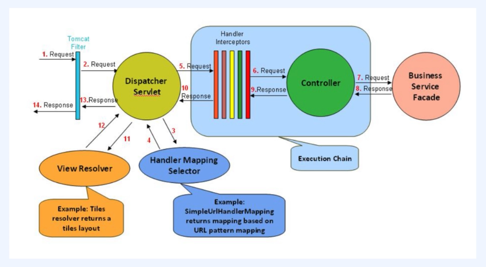

# 📘 서블릿 프로그래밍 정리

## 1. CGI 프로그램과 서블릿

### ✅ Servlet (Server + Applet)
- 자바에서 웹 애플리케이션을 만드는 기술
- 자바에서 **동적인 웹 페이지**를 구현하기 위한 **표준 API**

## 2. ServletContainer (서블릿 컨테이너)
- 컨테이너란?
  - 서블릿의 **생성부터 소멸까지의 생명주기(lifecycle)를 관리**하는 객체
- 역할
  - 웹 서버와의 **소켓 통신 처리**를 대신함
  - 서블릿을 로딩하고 초기화, 요청-응답 처리, 종료까지 관리
- 서블릿 객체는 **싱글톤(singleton)** 으로 관리됨
  - 상태를 갖는 설계(stateful)는 지양해야 함
  - 동시 요청 처리 시 **Thread-safe 하지 않음**

## 3. WAS vs 서블릿 컨테이너
| 항목 | 설명 |
|------|------|
| WAS (Web Application Server) | 서블릿 컨테이너를 포함하는 상위 개념 |
| 서블릿 컨테이너 | 서블릿의 생명주기를 관리하는 하위 구성 요소 |
| WAS 특징 | 매 요청마다 **스레드 풀에서 스레드를 할당** |
| 튜닝 포인트 | 최대 스레드 수 (max thread) |
| 예시 | **Tomcat** = 대표적인 WAS (서블릿 컨테이너 포함) |

## 4. Race Condition (경쟁 상태)
- 싱글톤 환경에서 **여러 쓰레드가 동시에 같은 자원에 접근**하면서 발생
- 의도하지 않은 결과가 나올 수 있음
- 해결 방법:
  - **상태를 가지는 설계(stateful)** → ❌ 지양
  - **Thread-safe한 설계** 필요
  - 싱글톤 환경에서 stateful을 지양하는 설계는 어느정도 Thread-safe를 달성할 수 있다.
  
## 5. Servlet의 생명주기 (Lifecycle)
  - init() → service() → destroy()
  - `init()` : 서블릿 초기화 (최초 1회)
  - `service()` : 클라이언트 요청을 처리
  - `destroy()` : 서블릿 종료 시 호출

## 6. 서블릿 구현 방식
- 직접 `Servlet` 인터페이스 구현
  - `init()`, `service()`, `destroy()` 전부 구현 필요
- `GenericServlet` 상속
  - 필요한 메서드만 선택적으로 오버라이드 가능
- `HttpServlet` 상속
  - HTTP 메서드(GET, POST 등)에 따라 처리 가능
  - `doGet()`, `doPost()` 등 오버라이드

## 7. Spring MVC 처리 흐름 (요약)
  
